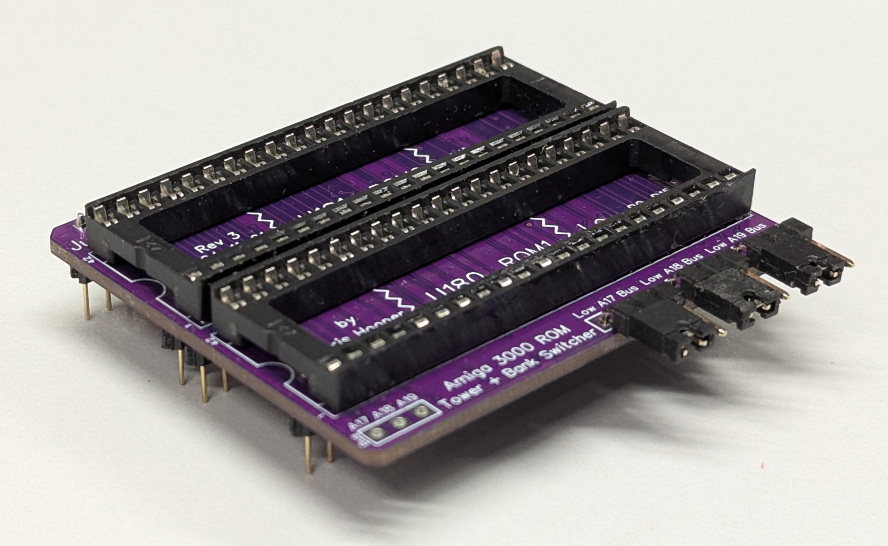

# amiga_rombankswitcher_a3000_romtower
Amiga 3000 ROM bank switcher for U182/U183 sockets (replaces the ROM Tower board, allowing normal 27C400/800/160 parts. User can select which bank to use either by jumpers or switches

The Rev3 version maintains the exact socket spacing and positions as the A3000 U180/U181 sockets. This means you can also install a Kicksmash32 in an older A3000.

See http://eebugs.com/amiga/rombankswitcher3000rt/ for more information, including assembly instructions.
